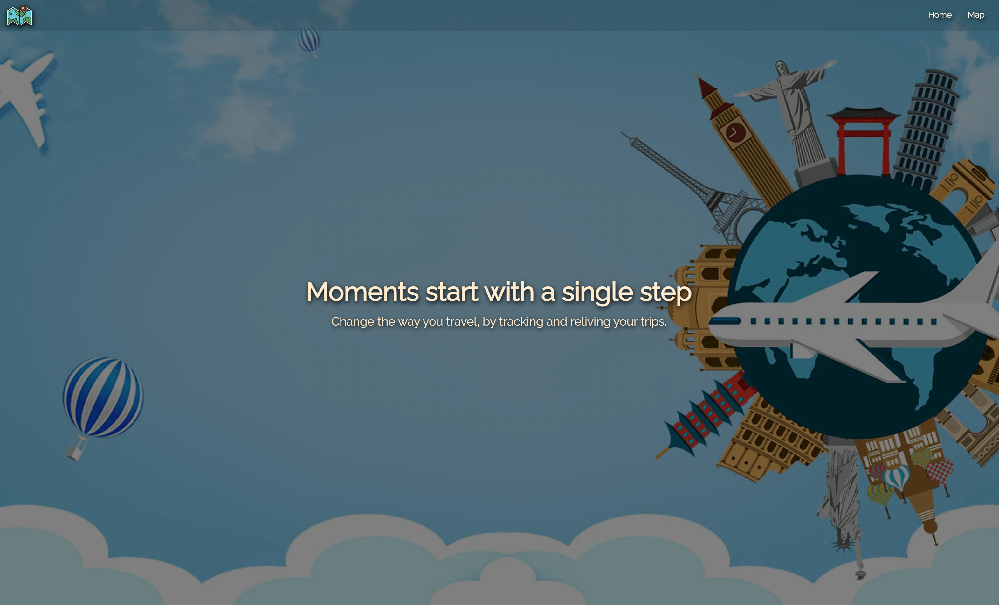
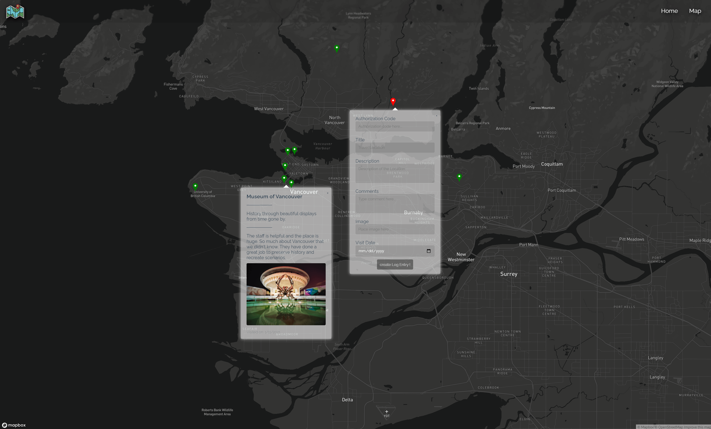

# Travel Log user Destinations

Some key Aspects:

- Displays a popup with the title, description, user comment, location image and date visited by the user.
- Clickable markers shows the users' destination details logged.
- Double click/tap the map to add a map destination entry.
- Uses Authorization to add a map destination entry.

Deployed live on https://travelog-live.herokuapp.com/ . Check out!

